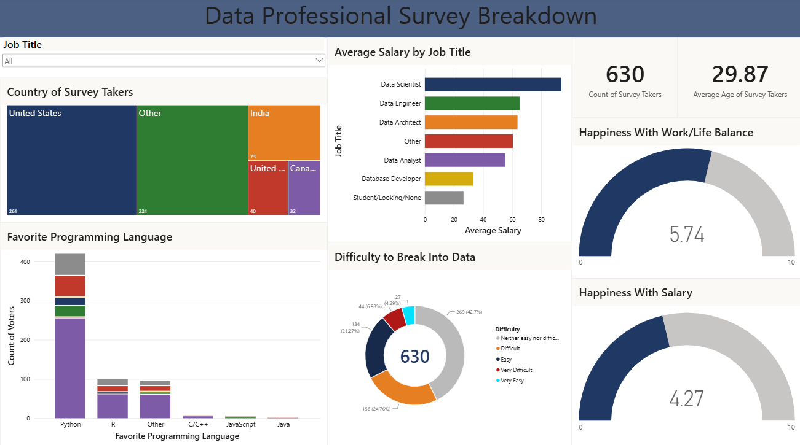
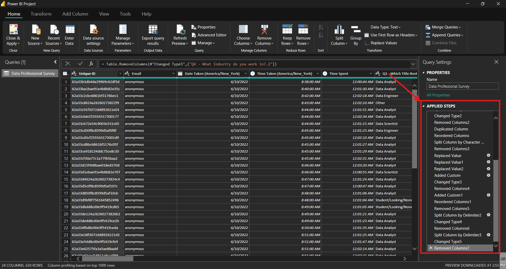

# Data Professional Survey Breakdown

An interactive Power BI dashboard analyzing survey data from 630 data professionals, exploring salary trends, job satisfaction, career entry difficulty, and popular tools within the data industry.




## 📌 Overview

This project transforms raw survey responses into a clean, interactive dashboard that helps answer questions like:

- How much do data professionals earn, broken down by job title?
- How satisfied are professionals with their salary and work/life balance?
- How difficult is it to break into the data field, according to those already in it?
- Which programming languages are most popular among data professionals?
- Where in the world are survey respondents located?

## 🛠️ Tools Used

- **Power Query** — Data cleaning and transformation (handling missing values, standardizing formats, removing duplicates, fixing data types)
- **DAX** — Custom measures for KPIs and calculated metrics
- **Power BI Desktop** — Data modeling and dashboard design

## 🧹 Data Cleaning Process

Before visualization, the raw survey data was processed in Power Query to:
- Remove duplicate and incomplete entries
- Standardize inconsistent text values (e.g., country names, job titles)
- Convert data types (numeric, categorical) for accurate aggregation
- Group low-frequency categories into an "Other" bucket for cleaner visuals

## 📊 Dashboard Features

| Visual | Description |
|---|---|
| **Country of Survey Takers** | Treemap showing geographic distribution of respondents |
| **Average Salary by Job Title** | Horizontal bar chart comparing average salary across roles |
| **Favorite Programming Language** | Stacked bar chart of language popularity, broken down by job title |
| **Difficulty to Break Into Data** | Donut chart showing perceived entry difficulty |
| **Happiness Gauges** | Satisfaction scores for work/life balance and salary (0–10 scale) |
| **Job Title Slicer** | Interactive dropdown filter applied across the entire dashboard |

## 🔑 Key Insights

- **Python dominates the field**: It is the clear language of choice among respondents, 
  far outpacing R and other languages combined — reflecting its central role in the 
  modern data stack (from analysis to machine learning).

- **The path into data isn't seen as a major barrier**: Only ~11% of respondents rated 
  breaking into the field as "difficult" or "very difficult," while the majority 
  (~43%) felt it was "neither easy nor difficult" — suggesting that structured effort, 
  rather than exceptional difficulty, is the main hurdle for newcomers.

- **Pay, not workload, is the bigger frustration**: Salary satisfaction (4.27/10) trails 
  work/life balance satisfaction (5.74/10) by a notable margin. This gap hints that 
  compensation — not hours or workload — may be the leading driver of dissatisfaction 
  and potential turnover in data roles.

- **The U.S. leads, but the field is globally distributed**: While the United States 
  represents the largest single group of respondents, it accounts for less than half 
  of the total sample — with meaningful representation from India, the UK, and Canada, 
  reflecting data as a genuinely global profession.

## 📁 Repository Structure

```
├── data/
│   └── survey_data_raw.csv
├── images/
│   └── dashboard_preview.png
│   └── power_query.png
├── README.md
├── dashboard.pbix
```

## 🚀 How to Use

1. Clone this repository
2. Open `dashboard.pbix` in Power BI Desktop
3. Use the **Job Title** slicer at the left top to filter the dashboard by role
4. Explore cross-filtering by clicking on any chart element (e.g., a country or job title)

## 📄 Data Source

This dataset is a public "Data Professional Survey" dataset used for practice purposes, 
originally featured in a tutorial by [Alex The Analyst](https://www.youtube.com/@AlexTheAnalyst) on YouTube.
This project focuses on independent data cleaning (Power Query) and dashboard design/insights.

## 📬 Contact

Feel free to connect or reach out with feedback:
- LinkedIn: [www.linkedin.com/in/mohamed-elshafie-a53232383]
- GitHub: [https://github.com/moshafie512]
